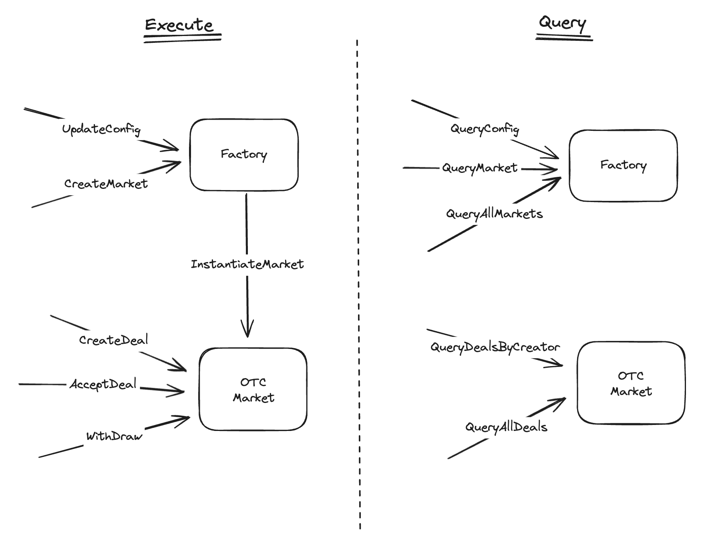
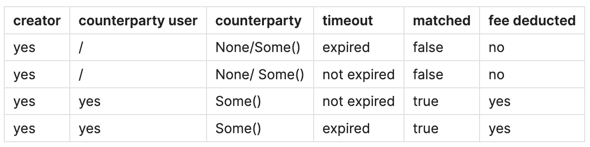

# CW-OTC

`cw-otc` is a smart contracts workspace that implements an over-the-counter market to securely allow two parties
to exchange values without a middleman and in a trust-minimized way.

## Contracts

The workspace is composed by two contracts:

- **Factory**: the factory has the purposes of orchestrating multiple markets. It keeps track of the
 available markets and to avoid creation of duplicates.

- **Market**: this is the main contract that implements the logic for otc exchange for a given pair.
Every market has the possibility to deifine a fee that is deducted from both the partiesduring an
exchange.

Below the draft of the MVP that highlights the APIs of the contracts and their interactions:



## How it works

### Factory

The factory is the first contract that should be instantiated. This contract allows to define an owner,
the only address that can create a market or update the config of the factory. During the instantiation
it is possible to specify the address of a fee collector that will receive fees from markets.

When a market is created  via the factory, it uses the code id of the market contarct given during the
instantiation and call the instantiate entry point of this contract to create a new market. A market is
defined by two denoms and a fee. Only native, IBC, and tokenfactory coins are accepted.

### Market

The market defines a single otc markets. Once instantiated, anyone can create a deal. A deal is composed
in the following way:

```rust
pub struct Deal {
    // Coin that the user wants to swap.
    pub coin_in: Coin,
    // Coin that the user wants to receive.
    pub coin_out: Coin,
    // Only address that can accept the deal.
    pub counterparty: Option<Addr>,
    // Block after which the deal expire.
    pub timeout: u64,
    // Already matched by a counterparty.
    pub status: DealStatus,
}
```

When a user decide to create a deal, it must specify the denom and amount of the coin they wants in exchange,
a timeout for the deal, and optionally a counterparty. By specifying a counterparty the contract allows
two users to have an agreement before exchange tokens. Howver, also an open deal is permitted and the
first user that accept the deal becomes the counterparty.

A deal creator can witdraw their deal is no one accepted it or, both parties can withdraw the counterparty
tokens after a deal is concluded. Below you can see the possible combination of withdraw depending
on the states of the deal. To be notice that fee are deducted only when a deal is accepted.



## Getting Started

These instructions will help you get a copy of the smart contract up and running on your local machine for development and testing purposes.

### Prerequisites

- [CosmWasm](https://github.com/CosmWasm/cosmwasm)
- Rust: [Installation Guide](https://www.rust-lang.org/tools/install)
- Command runner: [just](https://github.com/casey/just)

### Installation

1. Clone the repository and move into project directory:

    ```shell
    git clone <repository_url>
    cd <project_directory>
    ```

2. Build the smart contract:

    ```shell
    just optimize
    ```

## Usage

### Test

```shell
just test
```

### Lint

```shell
just clippy && just fmt 
```

### JSON Schema

```shell
just schema
```

## Considerations

- A better way to handling the owner update should be implemented.

- The withdraw part can be automatic without requiring users to withdraw when a deal is closed.

- Another variant of the execute can be created to handle the cancellation of a deal from the creator.
This will make the logic more clear. Now it is handled in withdraw.

- Use time instead of blocks for deal expiration.

- A logic to remove expired deal from the state should be implemented.

- Implement a logic in the factory to close or stop a market.

- Would be nice to allow IBC otc using a wasm middleware.

- Error handling can be improved.

- Would be nice to allows market with more than two coins.

## References

This workspace has been created using the [cw-starter](https://github.com/0xstepit/cw-starter) template.

## License

This project is licensed under the MIT License - see the LICENSE file for details.
